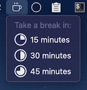
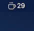
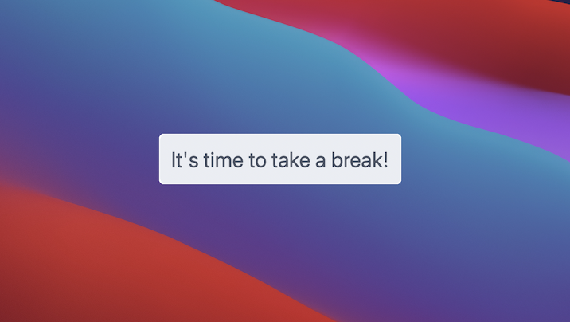
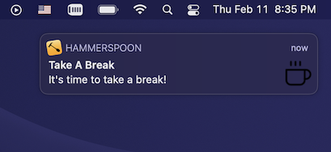

# Take a break

A simple menu bar app which sends a notification (or a popup alert) to take a break after a given time:



Time left in minutes:  


Alert:  


Notification:  


# Installation

 - download and install [Hammerspoon](https://github.com/Hammerspoon/hammerspoon/releases/latest)
 - download and install [Take a break Spoon]()
 - open ~/.hammerspoon/init.lua and add following snippet:

```lua
-- GitLab
-- take a break
hs.loadSpoon("takeABreak")
spoon.takeABreak:setup{notificationType = 'alert'} -- or 'notificaton'
```